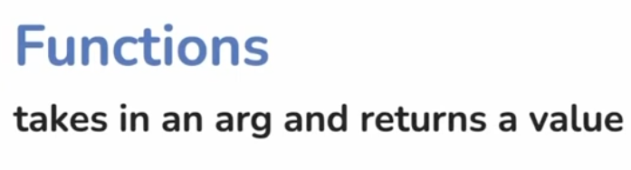
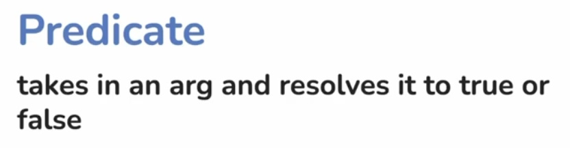
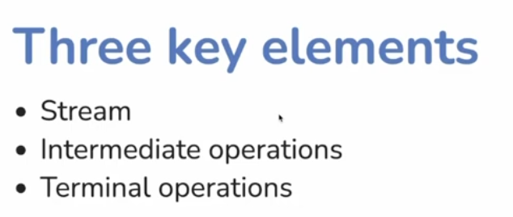
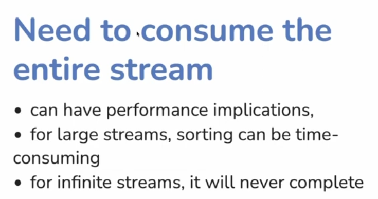

# Functional Programming in Java

## Lambdas vs Anonymous classes 

## The interface overhead of lambdas
 - The JDK functional interfaces

### Doesn't make sense

### We don't have out of the box solution for this, need to write custom functional interfaces

- Higher order functions and curryn

## Method scopes 

- Collections - Data Storage Mechanism
- Streams - Data Processing Mechanism

- Immutable and transformation intent (Streams)
- Collections (in-place modification)

