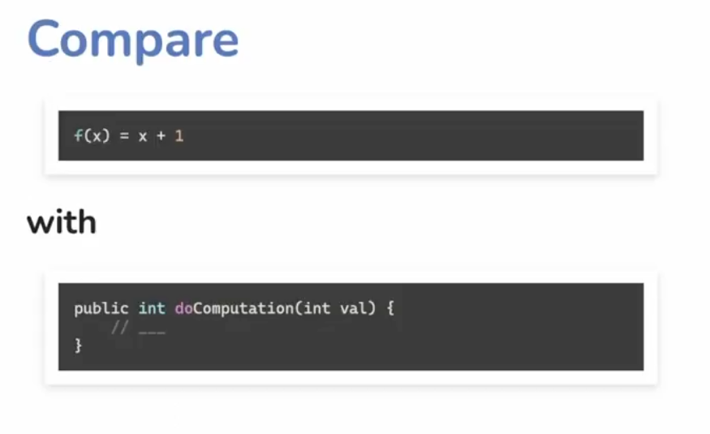
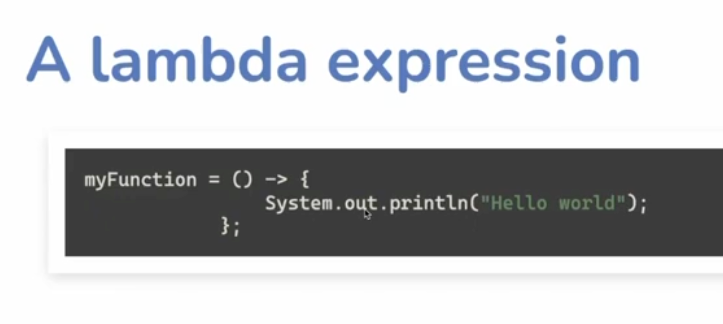
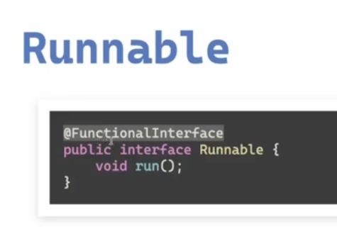

# Functional Programming in Java

  

  

  

  

  

  

  

  

  

  

  

  

  

  

  

  

  

  

  

  

  

  

  

  

  

  

  

  

  

  

  

## Lambdas vs Anonymous classes 

  

  

  

  

## The interface overhead of lambdas
 - The JDK functional interfaces

  

  

  

  

  

  

  

  

  

  

  

  

  

  

  

  

  

### Doesn't make sense

  

### We don't have out of the box solution for this, need to write custom functional interfaces

  

  

  

  

  

  

  

  

  

  

  

  
- Higher order functions and curryn

  

  

## Method scopes 

  

  

  

  

  

  

  

  

  

  

  

  

  

  

  

  

  

  

  

  

  

  

- Collections - Data Storage Mechanism
- Streams - Data Processing Mechanism

  

  

  

  

  

- Immutable and transformation intent (Streams)
- Collections (in-place modification)

  

  

  

  

  

